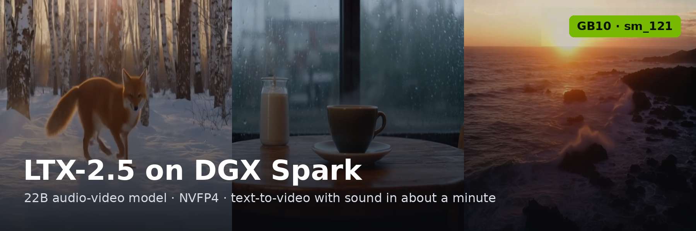
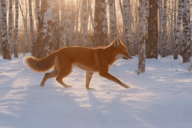
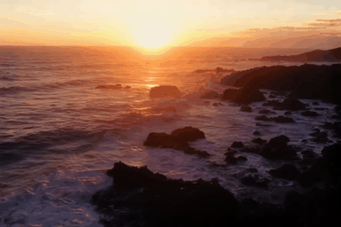
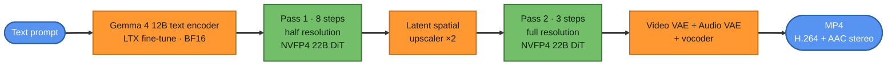
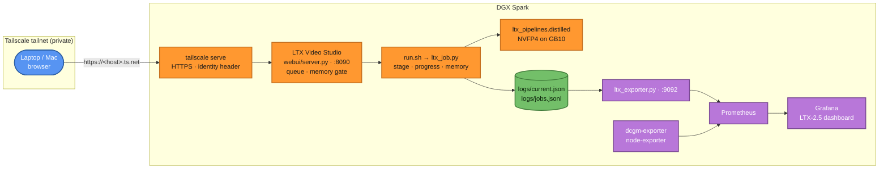
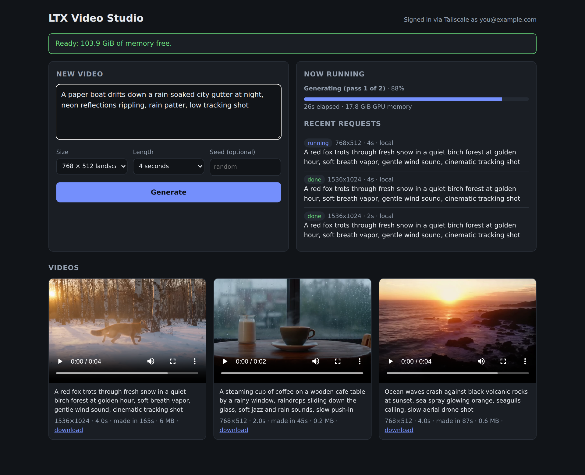
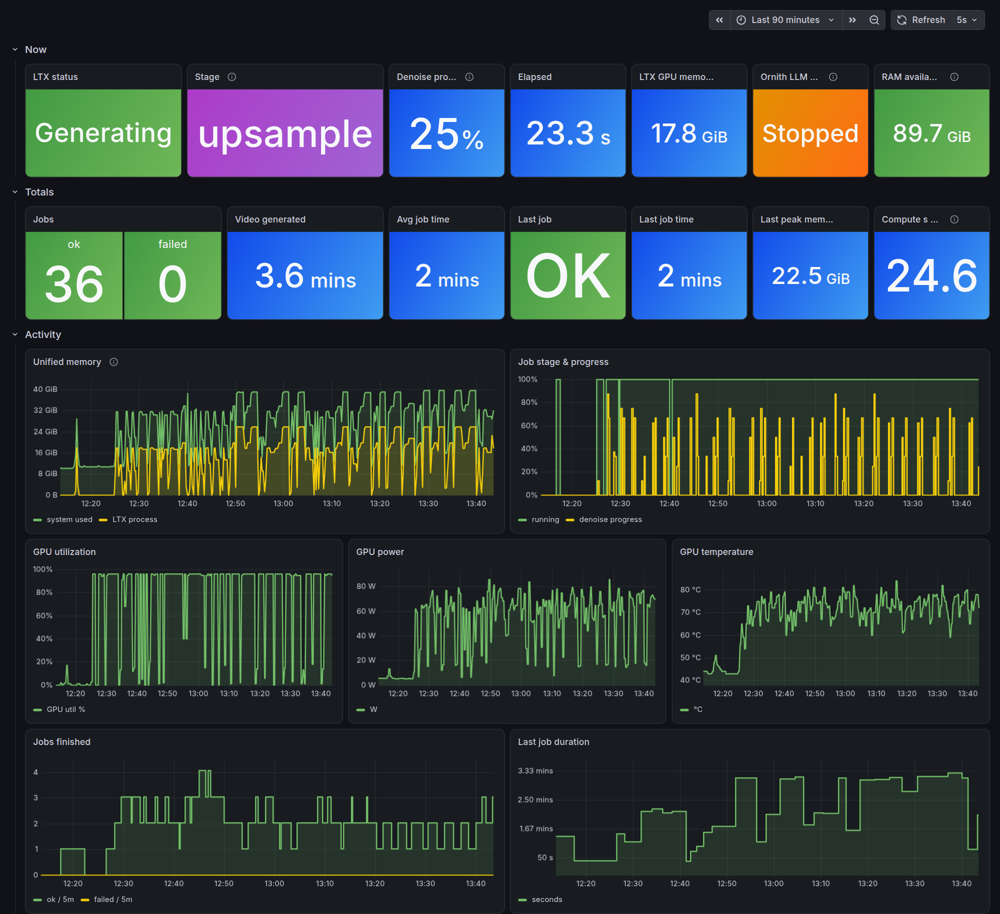
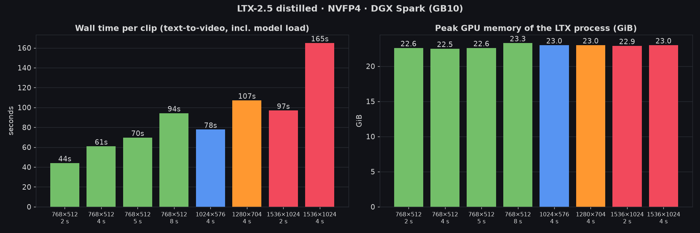

<div align="center">



# LTX-2.5 (NVFP4) on NVIDIA DGX Spark (GB10)

**Generate video with synchronized audio from a text prompt on a single DGX Spark: a 4-second 768×512 clip in about a minute, with a tailnet web studio and Grafana monitoring**

[](https://huggingface.co/Lightricks/LTX-2.5)
[](#configuration-reference)
[](https://github.com/Lightricks/LTX-2/tree/v1.4.2)
[-76B900)](https://www.nvidia.com/en-us/products/workstations/dgx-spark/)
[](https://pytorch.org/)
[](#credits--license)

</div>

---

## Overview

This repository is the working setup used to run
[**Lightricks LTX-2.5**](https://huggingface.co/Lightricks/LTX-2.5), a 22B-parameter audio-video
diffusion transformer, on a single **NVIDIA DGX Spark (GB10, Blackwell, 128 GB unified memory)**.
It is a sister project to the
[Ornith-1.5 LLM deployment](https://github.com/Hitheshkaranth/Ornith-1.5_A3B_Model_DGX_Spark_Setup)
on the same box.

It gives you:

- **A working NVFP4 build for GB10.** Lightricks ships a pre-quantized 4-bit (NVFP4) distilled
  transformer, but the upstream CUDA kernels are only compiled for `sm_100a`/`sm_110a`/`sm_120a`.
  GB10 is **`sm_121`**, and arch-specific (`a`) cubins don't load on a different minor version.
  A [three-line patch](patches/ltx-kernels-sm121a.patch) adds `sm_121a`.
- **One-command install.** `install.sh` pins the tested upstream tag and lockfile, applies the patch,
  builds the kernels and downloads the 44 GiB of weights.
- **LTX Video Studio**, a small web app: prompt in, video with sound out, served privately to your
  [Tailscale](https://tailscale.com/) tailnet, with a queue and per-user attribution.
- **Grafana monitoring:** live stage, progress and memory for every job, plus history and who asked for what.

> Every number in this README was measured on the deployment itself. See [Benchmarks](#benchmarks);
> raw data is in [`benchmarks/results.json`](benchmarks/results.json).

### Samples

All three were generated on the Spark with the commands in this README (768×512, 24 fps, with audio;
GIF previews are downscaled and silent).

| A red fox trots through fresh snow at golden hour | Coffee by a rainy café window, slow push-in | Sunset waves crash on volcanic rocks, aerial |
|:---:|:---:|:---:|
|  |  |  |
| 2 s clip | 2 s clip | 4 s clip |

## Table of Contents

- [Architecture](#architecture)
- [Hardware & Software Requirements](#hardware--software-requirements)
- [Quick Start](#quick-start)
- [Configuration Reference](#configuration-reference)
- [The GB10 (sm_121) Patch](#the-gb10-sm_121-patch)
- [LTX Video Studio (Web UI)](#ltx-video-studio-web-ui)
- [Monitoring with Grafana](#monitoring-with-grafana)
- [Sharing the Box with an LLM](#sharing-the-box-with-an-llm)
- [Benchmarks](#benchmarks)
- [Repository Layout](#repository-layout)
- [Troubleshooting](#troubleshooting)
- [Credits & License](#credits--license)

---

## Architecture

### Generation pipeline

`run.sh` drives the upstream `ltx_pipelines.distilled` pipeline: a two-pass distilled schedule
that renders at half resolution, upsamples in latent space, refines, then decodes both video and audio.



Each stage loads its model, runs, and frees it before the next, so peak memory stays around
23 GiB instead of the ~44 GiB sum of all the weights.

### Serving and monitoring



The command line and the web UI both go through `run.sh`, so every job, whatever started it, shows
up in Grafana.

---

## Hardware & Software Requirements

| | Tested with | Notes |
|---|---|---|
| GPU | NVIDIA GB10 (DGX Spark), compute capability **12.1** | NVFP4 needs Blackwell (≥ 10.0). `install.sh` builds for whatever it finds. |
| Memory | 121 GiB unified (CPU + GPU share one pool) | A job needs **~23 GiB** for the LTX process, **~29 GiB** system-wide at peak |
| Driver / CUDA | 580.173 (CUDA 13.0) | PyTorch's cu132 wheels run on it via minor-version compatibility |
| OS | Ubuntu 24.04 (aarch64), DGX OS | |
| Python | 3.13 (uv-managed) | System Python lacks headers needed by Triton and the kernel build |
| Disk | ~45 GiB weights + ~7 GiB env | |
| Network | Hugging Face account | `Lightricks/LTX-2.5` is gated with **auto-approval**: click *Agree* once |

## Quick Start

```bash
# 1. Accept the model terms (instant): https://huggingface.co/Lightricks/LTX-2.5
# 2. Log in to Hugging Face (opens a device-code flow; works over SSH)
uvx --from 'huggingface_hub>=2.1' hf auth login

# 3. Install: clone, patch, build env + NVFP4 kernels, download weights (~44 GiB)
curl -fsSL https://raw.githubusercontent.com/Hitheshkaranth/LTX-2.5_Video_DGX_Spark_Setup/main/install.sh | bash

# 4. Generate
cd LTX-2.5_Video_DGX_Spark_Setup
./run.sh "A red fox trots through fresh snow in a quiet birch forest at golden hour, soft breath vapor, gentle wind sound, cinematic tracking shot" \
         outputs/fox.mp4 --height 512 --width 768 --num-frames 97
```

Optional extras:

```bash
./setup-services.sh            # web UI on 127.0.0.1:8090 + Prometheus exporter on :9092
./setup-services.sh --tailnet  # ...and publish the UI to your tailnet over HTTPS
```

> **Prompting tip:** LTX generates sound too, so describe it. Subject, action, setting, lighting,
> camera movement *and* audio ("soft wind", "rain patter", "seagulls calling") give the best results.

## Configuration Reference

`run.sh "<prompt>" [output.mp4] [extra pipeline flags…]` wraps:

| Flag | Value | Why |
|---|---|---|
| `--quantization nvfp4-prequant` | | Load Lightricks' pre-quantized NVFP4 transformer and run FP4 tensor-core GEMMs |
| `--transformer-path` | `ltx-2.5-22b-distilled-transformer-nvfp4.safetensors` (17.4 GiB) | **Split layout**: use this, not `--distilled-checkpoint-path`, which expects a monolith |
| `--text-encoder-path` | `gemma4-12b-with-proj-ltx-2.5-bf16.safetensors` (24.5 GiB) | Gemma 4 12B fine-tuned for LTX, bundled in the model repo, so no separate Google license |
| `--video-vae-path` / `--audio-vae-path` | BF16 VAEs (1.4 / 0.3 GiB) | Docs pair NVFP4 transformers with BF16 VAEs |
| `--spatial-upsampler-path` | latent ×2 upscaler (0.9 GiB) | Drives the two-pass schedule |
| `--seed` | `42` by default | Override by passing `--seed N` after the output path |
| `PYTORCH_CUDA_ALLOC_CONF` | `expandable_segments:True` | Recommended upstream; reduces fragmentation between stages |

Useful extra flags: `--width`/`--height` (multiples of 64, since pass 1 runs at half size),
`--num-frames` (**8k+1**: 49 = 2 s, 97 = 4 s, 121 = 5 s, 193 = 8 s at 24 fps).

> `--offload cpu` gains nothing on a Spark, because CPU and GPU memory are the same physical pool.

## The GB10 (sm_121) Patch

Upstream builds its NVFP4 kernels only for arch-specific targets (`sm_100a`, `sm_110a`, `sm_120a`),
on purpose: the hardware FP32→E2M1 conversion (`cvt.rn.satfinite.e2m1x2.f32`) is only emitted for
`a` targets. Without it the quantize kernel falls back to software emulation and runs about 4× slower.
Arch-specific cubins are **not** forward-compatible across minor versions, so an `sm_120a` build
won't load on GB10's `sm_121`.

[`patches/ltx-kernels-sm121a.patch`](patches/ltx-kernels-sm121a.patch) adds `121a` to the arch list
and maps `TORCH_CUDA_ARCH_LIST=12.1` to it. The pip-installed `nvcc` 13.2 that ships with the env
supports `compute_121`. After building:

```text
$ LTX-2/.venv/bin/python -c "from ltx_kernels.nvfp4 import functional as f; print(f.unavailable_reason())"
None
```

A random 256×1024 · 1024×512 NVFP4 GEMM matches the BF16 reference to 13% relative error, which is
expected when both operands are quantized to 4 bits.

## LTX Video Studio (Web UI)

<div align="center">

</div>

A single-file, standard-library Python app (`webui/server.py` + `webui/index.html`):

- **Prompt → video:** size presets from 768×512 to 1536×1024 in landscape or portrait, lengths of
  2, 4, 5 or 8 s, and an optional seed.
- **Live progress:** stage name, denoise percentage, elapsed time and GPU memory, updated every 2 s.
- **Queue:** one job at a time, up to 10 waiting, in order. Benchmarks go through it too, so nothing overlaps.
- **Gallery:** every MP4 in `outputs/`, playable in the browser (HTTP range requests) and downloadable.
- **Memory gate:** refuses to start a job with less than 40 GiB free (`LTX_MIN_FREE_GIB`) and tells
  you if the LLM container is the reason, instead of letting the box swap.
- **Who asked:** behind `tailscale serve`, each job is tagged with the requester's Tailscale login
  (`Tailscale-User-Login`). On the optional direct listener it uses `tailscale whois` instead.

It binds to `127.0.0.1` only. `setup-services.sh --tailnet` publishes it at:

| URL | Path |
|---|---|
| `https://<host>.<tailnet>.ts.net/` | `tailscale serve` (HTTPS, auto cert) |
| `http://<host>:8090` | `tailscale serve --http 8090` (MagicDNS short name) |
| `http://<tailscale-ip>:8091` | Direct listener for clients without MagicDNS (serve routes by hostname, so a bare IP returns 404 there) |

All three are reachable from the tailnet only.

## Monitoring with Grafana

<div align="center">

</div>

`ltx_job.py` wraps every pipeline run. Once a second it rewrites `logs/current.json` (stage, step,
GPU memory from `nvidia-smi`), and when the run ends it appends a record to `logs/jobs.jsonl`.
`monitoring/ltx_exporter.py` turns both into Prometheus metrics:

| Metric | Meaning |
|---|---|
| `ltx_job_running`, `ltx_job_stage{stage}` | Is a job running, and which stage (text encoder, pass 1, upsample, pass 2, decode) |
| `ltx_job_step` / `ltx_job_steps` | Denoising progress in the current pass |
| `ltx_job_gpu_memory_bytes` | Live unified-memory allocation of the LTX process |
| `ltx_jobs_total{status}`, `ltx_jobs_by_user_total{user,source,status}` | Finished jobs, by requester and entry point (`cli` / `webui`) |
| `ltx_last_job_{duration_seconds,peak_gpu_memory_bytes,realtime_factor}` | Last job stats |
| `ltx_video_seconds_generated_total` | Seconds of video produced |
| `ltx_webui_up`, `ltx_webui_queue_jobs{state}`, `ltx_webui_rejected_low_memory` | Web UI health and queue |

The dashboard (`monitoring/grafana-dashboard.json`, 32 panels) combines these with
`dcgm-exporter` (GPU utilization, power, temperature) and `node-exporter` (unified memory).
Regenerate it with `python3 monitoring/make_dashboard.py [out.json]`, and add
[`monitoring/prometheus-scrape.yml`](monitoring/prometheus-scrape.yml) to your Prometheus config.

## Sharing the Box with an LLM

This Spark also serves an LLM ([Ornith-1.5-35B-A3B](https://github.com/Hitheshkaranth/Ornith-1.5_A3B_Model_DGX_Spark_Setup)
on vLLM). vLLM reserves memory up front, so the two only fit together if you shrink the LLM's reservation:

| | vLLM at `--gpu-memory-utilization 0.70` | vLLM at `0.45` |
|---|---|---|
| LLM reservation | ~85 GiB | ~55 GiB |
| LTX peak (system-wide) | ~29 GiB | ~29 GiB |
| Desktop session | ~8–10 GiB | ~8–10 GiB |
| **Total** | **~125 GiB: doesn't fit** | **~94 GiB: fits with ~27 GiB spare** |
| LLM KV cache | ~5.1M tokens (≈20 × 262K), measured | ~2.4M tokens (≈9 × 262K), estimated |

*The `0.70` column is measured; the `0.45` column is an estimate from the same numbers and hasn't
been run side by side yet.*

On unified memory, oversubscription doesn't fail cleanly: the kernel swaps and both workloads crawl.
Keep about 20 GiB available at all times. Both models also share one GPU, so LLM decoding slows
while a clip renders. This deployment runs them one at a time (stop the LLM, generate, restart it),
and the studio's memory gate enforces that.

## Benchmarks

Text-to-video, fixed prompt and seed (`benchmarks/bench.py`), submitted through the web UI queue on an
otherwise idle Spark. Wall time **includes loading every model from disk** (page-cached after the
first run): this is the real time from pressing *Generate* to having an MP4.

<div align="center">

</div>

| Size | Clip length | Frames | Wall time | Compute s per video s | Peak GPU memory (LTX process) |
|---|---|---|---|---|---|
| 768×512 | 2 s | 49 | **44 s** | 21.6 | 22.6 GiB |
| 768×512 | 4 s | 97 | **61 s** | 15.1 | 22.5 GiB |
| 768×512 | 5 s | 121 | **70 s** | 13.8 | 22.6 GiB |
| 768×512 | 8 s | 193 | **94 s** | 11.7 | 23.3 GiB |
| 1024×576 | 4 s | 97 | **78 s** | 19.2 | 23.0 GiB |
| 1280×704 | 4 s | 97 | **107 s** | 26.5 | 23.0 GiB |
| 1536×1024 | 2 s | 49 | **97 s** | 47.5 | 22.9 GiB |
| 1536×1024 | 4 s | 97 | **165 s** | 40.8 | 23.0 GiB |

**Takeaways**

- **Longer clips are cheaper per second.** At 768×512, a 2 s clip takes 44 s and an 8 s clip 94 s: 4× the video for about 2.1× the time. Model loading and the text encoder are a fixed cost per job, so the per-second cost drops from 21.6 to 11.7.
- **Resolution is what costs.** At 4 s, going from 768×512 to 1536×1024 (4× the pixels) raises wall time from 61 s to 165 s.
- **Memory is flat at ~22.5–23.3 GiB** across every size and length tested. Stages load and free their models one at a time, so the model weights set the peak, not the video size. Even 1536×1024 fits easily.
- **For quick iteration**, use 768×512 at 4–5 s (about a minute), then re-render the prompt you like at a higher resolution.

Reproduce with `python3 benchmarks/bench.py && LTX-2/.venv/bin/python benchmarks/make_charts.py`.

## Repository Layout

```text
.
├── install.sh                 # clone LTX-2 @ v1.4.2, apply patch, build env + kernels, download weights
├── download.sh                # the 5 weight files (~44 GiB) from Lightricks/LTX-2.5
├── run.sh                     # text-to-video CLI (NVFP4 distilled pipeline)
├── ltx_job.py                 # wraps each run: live stage/progress/memory + job history
├── setup-services.sh          # systemd --user units for web UI + exporter, optional tailscale serve
├── patches/
│   ├── ltx-kernels-sm121a.patch   # GB10 NVFP4 kernel build fix
│   └── uv.lock                    # exact tested dependency set (torch 2.13+cu132, natten 0.21.7, …)
├── webui/
│   ├── server.py              # LTX Video Studio: queue, memory gate, gallery, range-request video
│   └── index.html             # single-page UI (light/dark)
├── monitoring/
│   ├── ltx_exporter.py        # Prometheus exporter (:9092)
│   ├── make_dashboard.py      # generates the Grafana dashboard JSON
│   ├── grafana-dashboard.json
│   └── prometheus-scrape.yml
├── benchmarks/
│   ├── bench.py · make_charts.py · results.json · generation_benchmark.png
└── assets/                    # banner, sample GIFs, screenshots
```

Created at runtime and git-ignored: `LTX-2/` (patched upstream), `models/`, `outputs/`, and `logs/`
(job history includes prompts and requester logins).

## Troubleshooting

| Symptom | Fix |
|---|---|
| `401` / `403` downloading weights | Click *Agree* on [the model page](https://huggingface.co/Lightricks/LTX-2.5), then `hf auth login`. The device-code flow works on a headless box. |
| `nvfp4 unavailable: ... rebuild` | The kernels weren't built for your GPU. Re-run `install.sh`, or `cd LTX-2 && TORCH_CUDA_ARCH_LIST=12.1 uv sync --extra natten --group dev --group kernels` |
| `--distilled-checkpoint-path` errors with the split files | Use `--transformer-path` (as `run.sh` does); the NVFP4 file is the split layout |
| Studio says *Not enough free memory* | Something else holds unified memory (usually an LLM server). Stop it or lower its `--gpu-memory-utilization`; see [Sharing the Box](#sharing-the-box-with-an-llm) |
| Box crawls, swap climbs during a job | Same cause: available memory dropped below ~20 GiB. Never run both at full reservation. |
| `tailscale serve`: *Serve is not enabled on your tailnet* | Open the printed `login.tailscale.com/f/serve?...` link as tailnet admin and enable it |
| `tailscale serve`: *Access denied* | `sudo tailscale set --operator=$USER` once |
| Tailnet HTTPS URL times out on first visit | The first request provisions the TLS certificate; give it a minute |
| A device can't resolve `<host>.ts.net` | MagicDNS is off on that device. Use `http://<tailscale-ip>:8091` (`setup-services.sh --tailnet` sets this up) |
| `ffmpeg` not installed | Not needed: the pipeline encodes through PyAV, which ships its own FFmpeg |

## Credits & License

- **Model and inference code:** [Lightricks LTX-2](https://github.com/Lightricks/LTX-2) and
  [LTX-2.5 weights](https://huggingface.co/Lightricks/LTX-2.5), under the
  [LTX-2.x Community License](https://github.com/Lightricks/LTX-2/blob/main/LICENSE-2_x). This repo
  doesn't redistribute either; `install.sh` fetches them from the source. Read the license before
  commercial use.
- **Text encoder:** Gemma 4 12B as fine-tuned and bundled by Lightricks (Gemma terms apply).
- **Scripts, web UI, monitoring and patch in this repo:** Apache License 2.0.
- Built and measured on an NVIDIA DGX Spark. Sample clips in `assets/` were generated by this setup.
